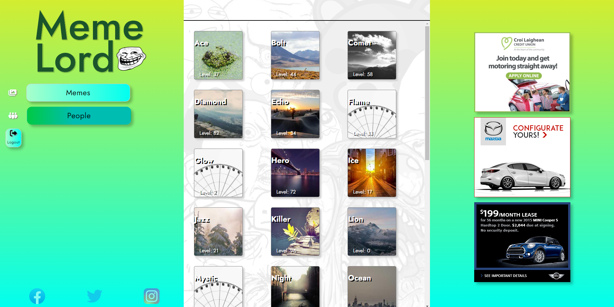

# MemeLord

MemeLord is a dynamic web application for creating, sharing and discovering memes. It is created using Docker, HTML, PHP, CSS, and JS, and offers a range of features to provide a complete meme-sharing experience.
## Table of Contents
- [Features](#features)
- [Docker Deployment](#docker-deployment)
- [Summary](#summary)
- [Screenshots](#screenshots)
## Features
- **Adding new memes**: Users can upload and share their own memes on the platform.
- **Viewing users:** Users can view other users.
- **Searching memes:** The platform allows users to search for memes based on keywords or tags.
- **Saving user sessions:** The platform saves user sessions, allowing users to pick up where they left off.
- **Graphical features:** MemeLord features animations, ads and transitions, providing a visually appealing experience.
## Docker Deployment
MemeLord can be deployed using Docker, making it easy to set up and run the application on any system. The following are the steps to deploy MemeLord using Docker:
1. Install Docker on your system.
2. Clone the MemeLord repository from GitHub.
3. Navigate to the MemeLord directory and build the Docker image using the following command:
```
docker build -t memelord .
```
4. Run a container from the MemeLord image using the following command:
```
docker run -p 80:80 --name memelord-container memelord
```
5. Access the MemeLord application by opening a web browser and navigating to **http://localhost**.
## Summary
MemeLord provides a complete meme-sharing experience, with a range of features for adding, searching and discovering memes. The platform is built using modern web technologies and can be easily deployed using Docker, making it accessible to anyone. Whether you're a meme creator or simply looking for a fun platform to discover new memes, MemeLord has you covered.
## Screenshots



